# MEGA Tinyjoypad for ESP8266  
Сайт оригинального проекта с исходниками прошивки:  
https://www.tinyjoypad.com/esp8285  
https://sites.google.com/view/arduino-collection/esp8285  
  
Авторская схема устройства:  
  
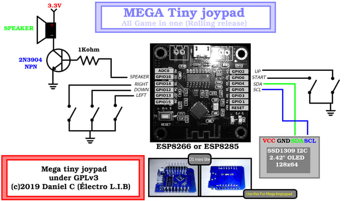  
  
Авторская схема при сборке устройства предполагает минимальный набор компонентов. Для этого применяется готовый модуль Wemos D1 mini, OLED дисплей, кнопки, динамик и несколько обвязочных элементов.  
  
Мне хотелось в своей конструкции немного расширить функционал и придать вид готового устройства.  
Корпусом (если можно так назвать) устройства являются две печатные платы, на которых располагаются все элементы. Размеры плат сделаны под размер банковской карты 85.6 х 54.0 мм. Высота (без учета выступающих кнопок) устройства 15.2 мм. Соединение двух печатных плат происходит посредством латунных стоек М2.5х12 с вкручивающимися в них с двух сторон винтами с плоской шляпкой.  
  
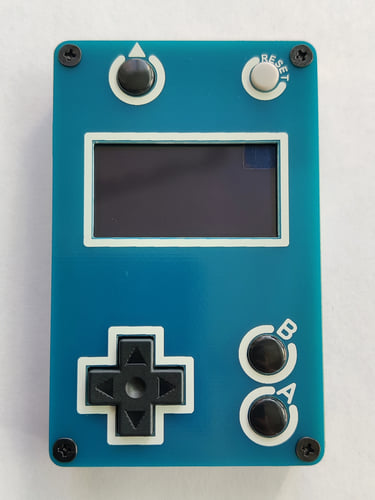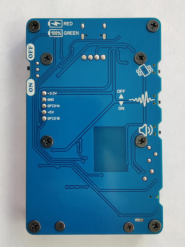  
  
Сердцем устройства является стандартный модуль ESP-12F на чипе ESP8266. Для прошивки ESP-12F используется конвертер USB to TTL на базе микросхемы CH340N. Эта микросхема не имеет на своем борту выводов DTR и RTS, поэтому для загрузки прошивки необходимо производить некоторую манипуляцию. Ниже описана процедура прошивки.  
  
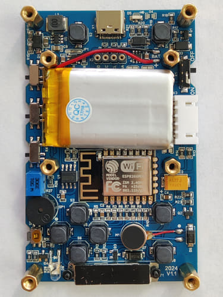  
  
В схему был добавлен аккумулятор и элементы для его заряда через стандартный разъем USB Type-C.  
Помимо динамика в устройстве есть обычный вибромотор и вибро от iPhone 6, что дает дополнительные тактильные ощущения при игре. Ну и не обошлось без фонарика.  
  
**Дополнительные функции.**  
Устройство можно использовать в качестве учебного - писать/отлаживать свои прошивки, подключать дополнительные устройства. Для этого на боковой стороне устройства расположился разъем с выводом питания 3.3В, 5.0В и двумя GPIO.  
Так же к ESP-12F были подведены (через перемычки припоем) от микросхемы зарядки две линии, которые указывают на процесс зарядки аккумулятора и его окончание. Таким образом в свои прошивки можно добавить индикацию процесса заряда аккумулятора.  
В устройстве есть возможность измерять напряжение на аккумуляторе посредством пина ADC контроллера ESP8266. Для этого используется делитель напряжения R3/R4.  
Все вышеописанные дополнительные функции не поддерживаются авторской прошивкой и предназначены для самостоятельной реализации.  
  
## Сборка устройства  
  
В репозитории находятся необходимые файлы для самостоятельного изготовления данной игровой консоли.  
 - Папка **driver** - рабочие драйвера для микросхем CH340/CH341. Некоторые микросхемы не поддерживаются более новыми версиями драйверов (зависит от оригинальности микросхемы).  
 - Папка **firmware** - исходные файлы (слегка подправленные под мою версию платы) для среды Arduino IDE. Так же в этой папке можно найти готовый файл прошивки с расширением bin.  
 - Папка **pcb** - gerber файлы для изготовления печатных плат.  
 - Папка **photo** - фотографии изготовления и сборки устройства.  
 - Папка **schemes** - схема и список компонентов.  
  
Если Вы паяете обычным ручным паяльником, то для удобства монтаж элементов необходимо производить от маленьких к большим. Для такой пайки лучше всего использовать водосмываемые флюсы и обычный припой без канифоли. Обязательно после монтажа промойте плату в теплой воде (в идеале в дистиллированной) при помощи зубной щетки. Даже если Вы припаяли не все элементы и решили оставить часть на следующий день, то промойте плату в воде, не оставляйте флюс на плате на долгое время. После мойки плату желательно просушить теплым воздухом (сушильный шкаф с температурой 60-70 гр.). В домашних условиях сушильный шкаф заменит батарея отопления.  
Вибромотор и аккумулятор нельзя мыть в воде, поэтому они монтируются в последнюю очередь с применением припоя с канифолью или при помощи неактивного, не требующего отмывки (NO CLEAN) флюса.  
  
Для уменьшения толщины устройства, для электрического соединения основной платы и OLED дисплея, мною был применен цанговый разъем. Для этого необходимо выпаять заводской разъем из платы дисплея, освободить от припоя монтажные отверстия и припаять новый разъем с круглыми контактными штырьками. Если нет цангового разъема, то с натяжкой можно использовать на основной плате разъем PBS-4 и штатный разъем на дисплее, но для этого с разъема на дисплее необходимо удалить пластиковый изолятор, оставив на плате только контактные штырьки. Учтите, что высота разъема PBS-4 - 8.5 мм, а высота латунных стоек для крепления дисплея - 8 мм.  
  
В качестве толкателей для кнопок мною были использованы деревянные палочки для маникюра, отрезанные и подточенные под необходимый размер. Толкатели для джойстика были изготовлены из стержней пластиковых вытяжных заклепок CR32-1 (CR32-2, CR32-3), которые зафиксировал суперклеем. Используйте любые подручные материалы.  
  
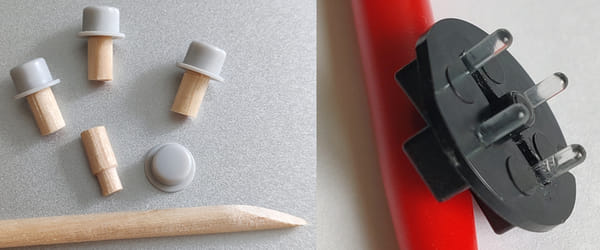  
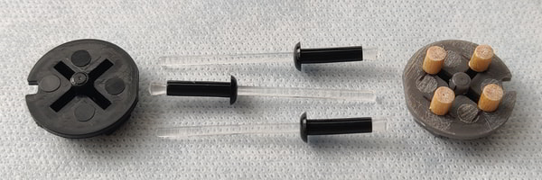  
  
Для защиты OLED дисплея я приклеил на него защитное стекло от Xiaomi Mi Band 8 Pro с AliExpress.
  
## Быстрая прошивка устройства  
  
Если Вы после сборки сразу хотите загрузить прошивку, не разбираясь с Arduino IDE, то загрузите в устройство готовую прошивку **MEGAcompilation160mhz_v0026.bin** программой Flash Download Tool.  
Смотрите скриншот настроек программы.  
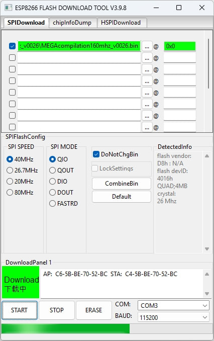  
  
Скачать программу Flash Download Tool с официального сайта:  
https://dl.espressif.com/public/flash_download_tool.zip  
  
Для загрузки прошивки необходимо перевести устройство в режим загрузки:  
  
0. Отключите питание устройства (если было включено).  
1. Соедините компьютер и устройство USB кабелем.  
2. Нажмите и удерживайте кнопку А.  
3. Включите питание устройства.  
4. Отпустите кнопку А.  
5. В программе Flash Download Tool выберите COM порт, который Windows присвоил устройству после его включения (можно посмотреть в диспетчере устройств Windows).  
   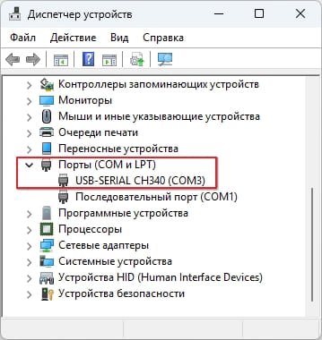  
   Укажите в программе путь до файла MEGAcompilation160mhz_v0026.bin  
   В окошке напротив файла впишите начальный адрес прошивки 0x0  
6. Загрузите прошивку (нажмите кнопку START).  
7. После успешной прошивки отключите питание устройства.  
8. Отсоедините USB кабель.  
9. Включите устройство и играйте!  
  
P.S. Перед прошивкой желательно очистить контроллер устройства.  
Переведите устройство в режим загрузки (пункты 0-5) и нажмите в программе кнопку ERASE. После этого можно прошивать.  
  
## Компиляция и прошивка с помощью Arduino IDE  
  
При желании скомпилировать и прошить устройство можно средствами Arduino IDE.  
Для компиляции прошивки используется:  
- версия ядра ESP8266 2.7.4 или 3.1.2  
- библиотека esp8266 oled ssd1306  
  
Скачать Arduino IDE 1.8.19 можно по ссылке:  
https://downloads.arduino.cc/arduino-1.8.19-windows.exe
  
Это последняя стабильная версия из линейки 1.X. Далее будут скриншоты из этой версии. Можно использовать Arduino IDE 2.X.  
  
### Установка ядра ESP8266  
В Arduino IDE в меню «Файл» выберите пункт «Настройки».  
В открывшемся окне нажмите на кнопку справа от поля «Дополнительные ссылки для Менеджера плат»  
  
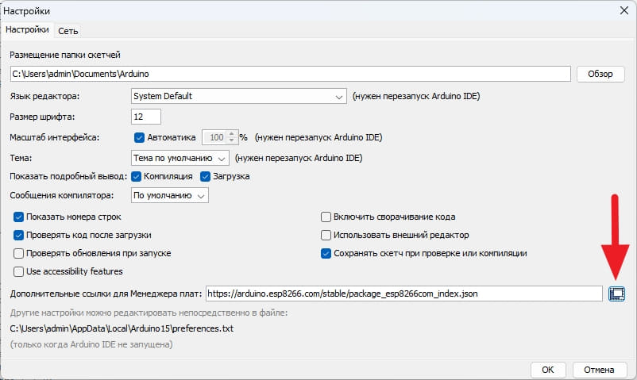
  
В открывшемся окне добавьте в поле ввода следующую строку:  
`https://arduino.esp8266.com/stable/package_esp8266com_index.json`  
  
В Arduino IDE в меню «Инструменты» → «Плата:» выберите пункт «Менеджер плат».  
В строке поиска наберите «ESP8266», найдите блок **esp8266 by ESP8266 Commumity**  
  - Выберите версию ядра 3.1.2  
  - Нажмите кнопку «Установка», дождитесь завершения установки.  
  - Должна появиться надпись, подтверждающая, что Вы установили правильную версию ядра системы.  
  
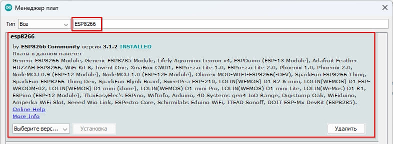  
  
### Установка библиотеки esp8266 oled ssd1306  
В меню «Инструменты» выберите пункт «Управлять библиотеками»  
В строке поиска наберите «SSD1306», найдите блок **ESP8266 and ESP32 OLED driver for SSD1306 displays by Thing Pulse**
  
  - Выберите версию библиотеки 4.6.1 (с другими версиями не пробовал).  
  - Нажмите кнопку «Установка», дождитесь завершения установки.  
  - Должна появиться надпись, подтверждающая что библиотека установлена.  
  
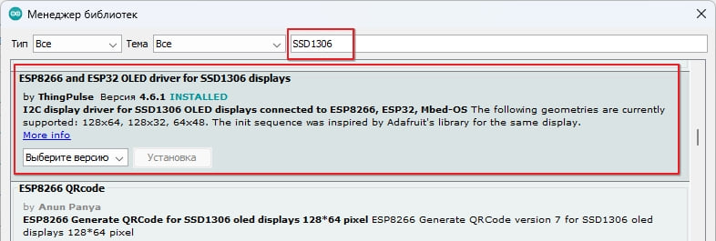  
  
Библиотеку esp8266 oled ssd1306 так же можно скачать из [репозитория разработчика](https://github.com/ThingPulse/esp8266-oled-ssd1306/releases) или из папки **libraries**  
  
### Компиляция прошивки и загрузка ее в устройство  
  
В проводнике откройте папку с проектом, перейдите в папку **firmware** и далее в папку **MEGAcompilation160mhz_v0026**  
Дважды щелкните на файле «MEGAcompilation160mhz_v0026.ino»  
Откроется Arduino IDE с данным проектом. Файлы проекта располагаются в нескольких вкладках.  
В меню «Инструменты» в пункте «Плата» в выпадающем списке выберите «ESP8266 Boards (3.1.2)» и далее плату «Generic ESP8266 Module».  
Переведите устройство в режим загрузки:  
  
0. Отключите питание устройства (если было включено).  
1. Соедините компьютер и устройство USB кабелем.  
2. Нажмите и удерживайте кнопку А.  
3. Включите питание устройства.  
4. Отпустите кнопку А.  
  
Выполните настройки, как указано ниже на скриншоте  
  
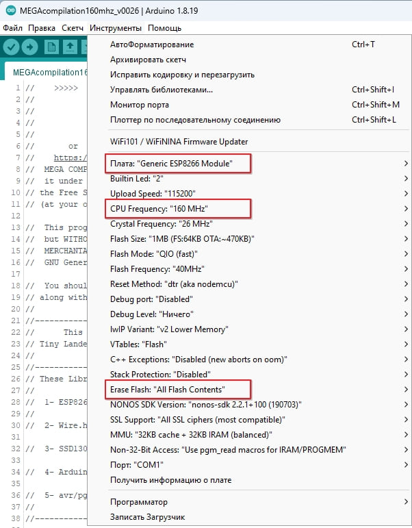
  
Выберите COM порт, который Windows присвоил устройству после его включения (можно посмотреть в диспетчере устройств Windows).  
В меню «Скетч» выберите «Загрузка».  
Дождитесь окончания сборки проекта компилятором и завершения операции загрузки.  
В черном поле редактора будут отображаться служебные сообщения, а так же прогресс загрузки в процентах. После завершения операции загрузки появится надпись «Leaving... Hard resetting via RTS pin...»  
  
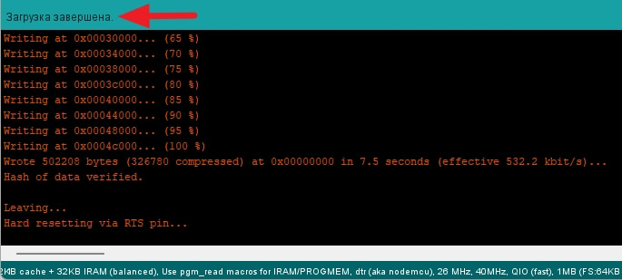  
  
После успешной прошивки отключите питание устройства. Отсоедините USB кабель.  
Включите устройство и играйте!  